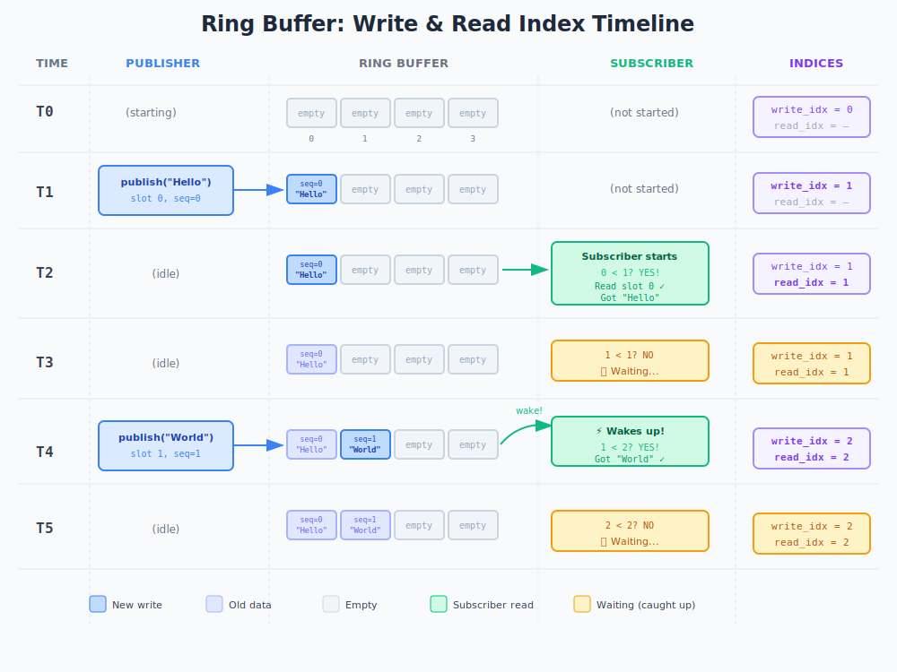

# Write Index and Read Index

## How it works



**The rule:**
```
read_idx < write_idx  →  Data available, read it
read_idx == write_idx →  Caught up, wait
```

## The three numbers

| Name | Meaning |
|------|---------|
| `write_idx` | How many messages have been written |
| `read_idx` | Which message I want next |
| `sequence` | Which message is in this slot |

`write_idx = 5` means messages #0-#4 exist. Subscriber with `read_idx = 3` can read message #3 immediately.

## Overwrites

With 4 slots, message #4 overwrites slot 0 (previously held #0). The `sequence` field detects this:

```
Subscriber wants message #5
Slot = 5 % 4 = slot 1
Read slot 1 → sequence = 9
Expected 5, got 9 → OVERWRITTEN! Skip ahead.
```

See [Sequence Numbers](sequence.md) for details.

---

**Next:** [Sequence Numbers](sequence.md)
