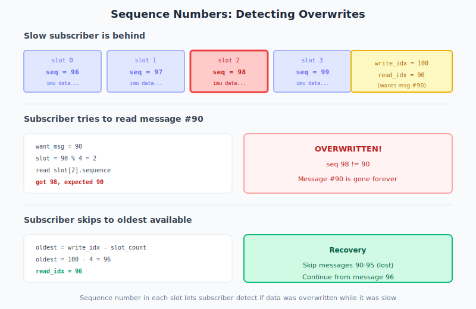

# Sequence Numbers

How subscribers detect when they're too slow and missed messages.



## The problem

Slow subscriber wants message #90, but slot 2 now holds message #98. Reading it would give wrong data.

## The solution

Each slot has a `sequence` field. Subscriber checks:

```
expected: 90
got:      98
98 ≠ 90 → OVERWRITTEN!
```

## Recovery

Skip to oldest available message:

```
oldest = write_idx - slot_count
       = 100 - 4
       = 96
```

Messages 90-95 are lost. Continue from 96.

---

**Next:** [Futex](futex.md) — How subscribers sleep efficiently
